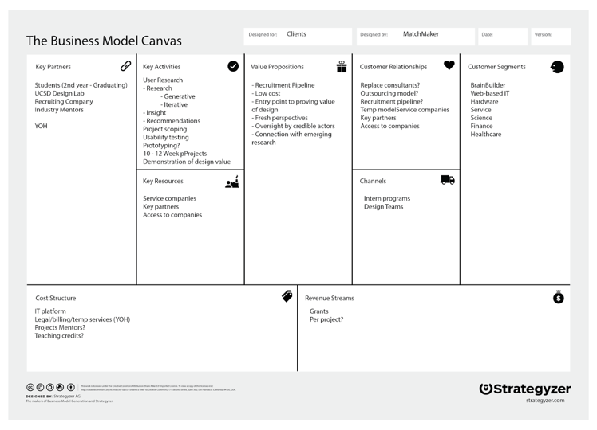
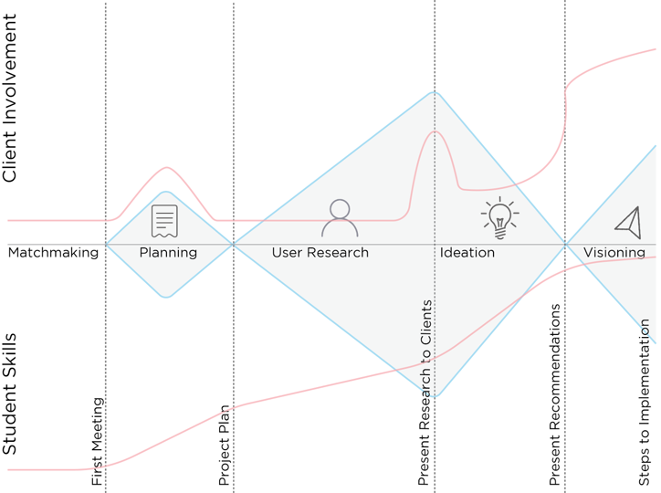
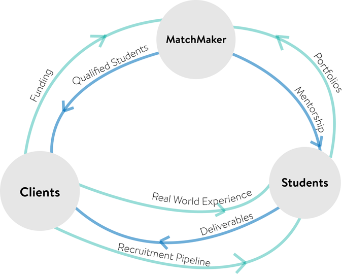
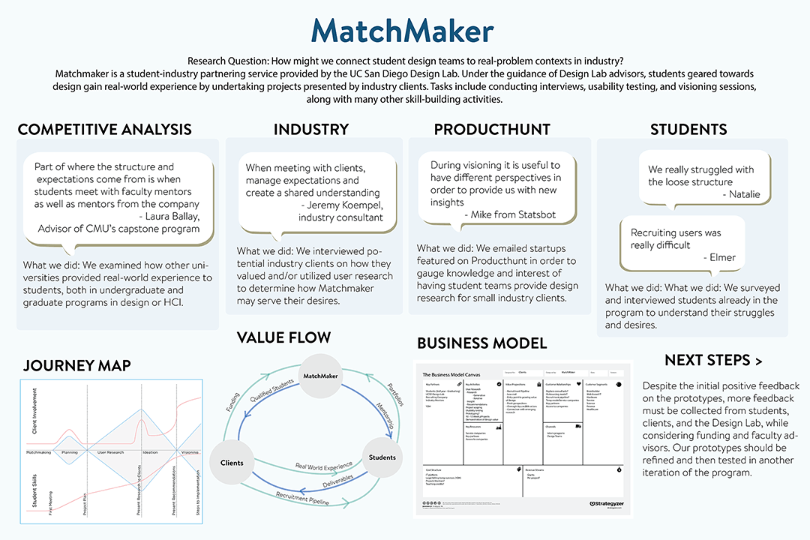
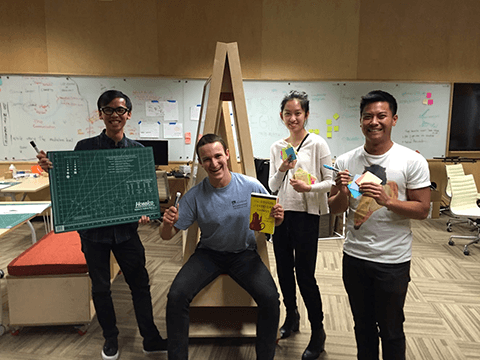

import ProjectsFooter from '../components/projectsFooter'

# Matchmaker
## Understanding industry and academia cooperation

### Summary
The UC San Diego Design Lab looked at industry projects as a way to
improve design education. In collaboration with SAP, we began work on
Matchmaker, a platform for connecting academia and industry together.

### Process
The Matchmaker concept was in its early stages when work began. My team
was assigned with researching the needs of platform users. We began our
research by segmenting our stakeholders into three groups: students,
instructors, and industry professionals. We wanted to examine their
existing relationships and to evaluate how a platform might develop these
relationships.

#### Academia
We conducted research on students and professors by examining design
curricula at universities throughout the country. We collected student
data by analyzing Design Lab applications and interviewing interns. Our
project manager and professors of various disciplines provided their
perspectives as instructors.

##### Instructors
- want their students to do meaningful work
- want to build relationships with industry partners
- struggle with availability for students

##### Students
- want projects relevants to their careers
- want to maximize time spent with mentors
- struggle with project clarity

#### Industry - Product Hunt
I was in charge of reaching out to industry professionals on 
[Product Hunt](https://www.producthunt.com). We believed Product Hunt could be 
a source of clients for the platform. We contacted the teams behind 50 trending 
ideas to gauge their interest. We A/B tested our outreach email to see which 
type of wording garnered themost interest, though we found no discernible 
difference in responses.

We succeeded in sending 49 emails of which we received 9 responses. 4 were
interested, while the remaining 5 were not ready for or had no desire for
interns. I interviewed one company to gain more insight into the value
they felt the program provided. They discussed how they had utilized
user research in a previous company, but at their current startup, they
could only afford analytical/quantitative data. A key value they saw in
Matchmaker was the ability to have fresh opinions.

> We want user researchers to be independent judges for user needs

They emphasized how having different opinions allowed them to evaluate if
their vision for their company was a "good vision." Other companies later
echoed this desire for new perspectives, which helped validate the need
for the platform.

Due to lack of testing, companies were unsure about our platform's use to
them. In the prototyping stage, case studies became the answer to this
doubt. Case studies show off previous work done with previous clients and
demonstrate the quality of work that companies can expect from students.
For case studies to work, we needed a client who would provide the first
projects to showcase. This is where SAP came in.

#### Industry - SAP
SAP was interested in Matchmaker due to their general desire to improve
design education. As a potential client, they discussed roadblocks that
they would encounter if they tried to worked with Matchmaker. Problems
included...
- needing to protect their intellectual property
- varying scale and availability of projects
- budgeting time and money for interns
- inability to provide mentorship

SAP suggested targeting smaller businesses, where the logistics of a large
company were non-existent. We also modified our language to shift the
focus away from design and more towards business value. With Product Hunt
and SAP, they were aware of the value of design. However, for local
businesses, we needed to demonstrate the value of design and user
research. From this came our first deliverable: a business model canvas.

Our business model canvas was made to facilitate conversations between us
and potential clients. We outlined the services we could provide along
with the expected involvement of each group. Additionally, we demonstrated
the business viability of the concept by showing how funds would be
collected and used throughout the platform.

### Additional Deliverables
#### Journey Map
Based on feedback, we developed a mock project schedule visualized via a
journey map. We emphasized minimal client involvement, as that was a
desire with several companies we talked to. We also plotted out the
expected growth of students' skills, as the program original came from
this desire. This journey map would later transform into sample timelines
of week-by-week expectations from the platform users.

#### Value Flow Model
We also developed a rough value flow model. There was a desire for the
Matchmaker platform to be self-sustaining, so we outlined the ecosystem.
Modifications to the model would reflect fundamental changes needed to
make Matchmaker a reality. Additionally, the value flow model was a 
summary of how Matchmaker addresses the needs we had identified.

These deliverables summed up the research my team had done. They were the
foundation of later research and the beginnings of the platform's
development. To summarize our work, and lay out our next steps, we created made 
slides to present. However, this would be converted into a poster that we could 
present at the Design Lab's poster sessions. 

### Reflections
The scope of the project was not clear at the beginning, and only lessened
in clarity towards the end. However, this ambiguity provided much growth
as it required my team to look for answers wherever we could. Sometimes
we pivoted and sometimes we just toughed it out.

I would like to give a big THANK YOU to Derek Lomas, members from SAP, and
the UC San Diego Design Lab for providing mentorship throughout this
opportunity. Lastly, thank you to to my teammates Joel, Madeline, and
Grant!

<ProjectsFooter active="Matchmaker" />