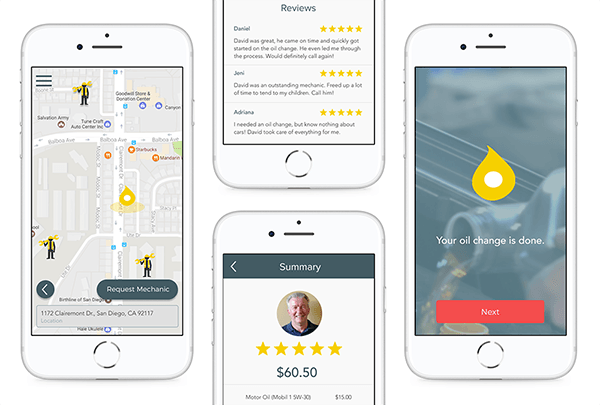
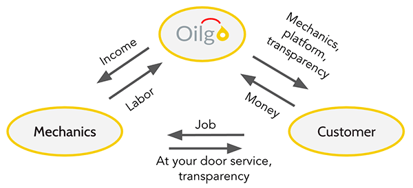
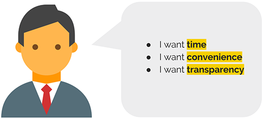
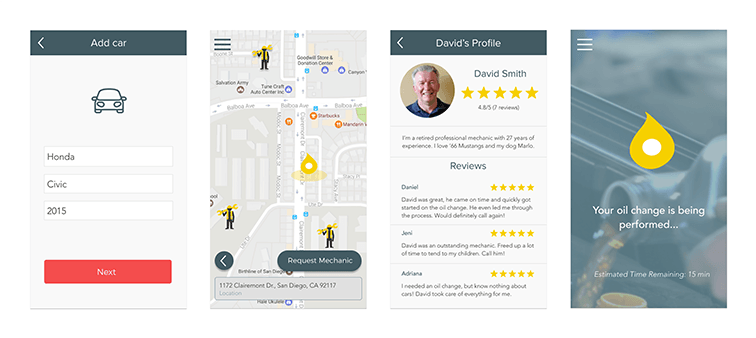
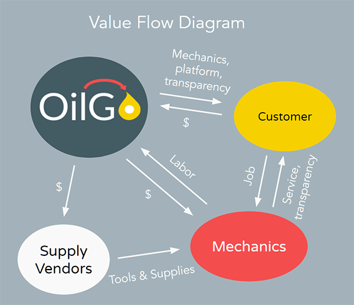

# OilGo
## Making car maintenance more convenient

### Summary
Save yourself time and money from car maintenance by having a car mechanic
come to you. For our startup studio class, myself and a team of three
other designers created a service to revolutionize how car maintenance
works.

Challenge: Identify a problem that people currently face. Design and
iterate through prototypes that address the problem, re-framing the
problem as needed. Understand and balance the technical feasibility,
financial viability, and desirability of the proposed solution.

### Process
#### Identifying and Validating a Problem
We began to find problems by looking at ideas that were important to us.
One idea was tool rentals that leveraged the growing sharing economy. This
would be based on successful startups such as Lyft and Airbnb. While tool
rentals did not become our final concept, we realized we wanted to keep
the concept of a sharing economy, with people’s skill and expertise as the
thing that was being shared. We then asked...

> How might we enable people to share their expertise in order to
> save others time?

Our answer came in the form of OilGo: a mobile service where people who
need an oil change can request a local mechanic to come to their car and
change their oil, reducing the need to visit an auto shop for car
maintenance.

###### Our original value flow model

We interviewed hobbyist and professional car mechanics about our concept.
They were supportive but were concerned that car owners might not trust
them with their cars. However, after discussing Lyft and Airbnb, they
realized that people are generally trustworthy.

To recruit customers, we pitched our idea to people near our college
campus. We were met with overwhelming demand, so we went straight into
offering our services. A team member scheduled the oil changes and
performed them with much satisfaction. Customers responded positively, as
we had addressed issues such as time, convenience, and transparency that
were often a problem with auto shops. We did note that people did want to
verify our reputation, such as by contacting mutual friends to know if we
were trustworthy.

###### People told us they wanted from a service like OilGo

#### Refining the Idea
The next step was to improve our service. We began by developing the
branding of our idea, from the name to the visual design. We also thought
about how we could better provide the service, so we evaluated ways to
provide the service. I worked on advertising by running ads through Google
Adwords, where I A/B tested different forms of branding. We found that
most people interested in the idea were discovering it through mobile
devices, which helped support our idea that it the service should be
provided through a mobile app.

#### What our app needs
- People need a way to plan and schedule
- People need to choose what maintenance they want for their cars
- Mechanics need to be trustworthy
- Prices need to be transparent

With the application's needs identified, the team worked on wire frames
and prototypes. We made a set of screens to address each need. Customers
would start by putting in their info, then schedule, browse mechanics, and
then wait for their service.

###### This was the result of our prototyping

### Evaluating the Concept as a Business
This was a weak point in our idea. We were a team composed of mostly
designers, but we needed to find out if it could actually work as a
business. We developed a value flow model to demonstrate the business
viability of our service. Our service was free during testing because we
wanted to easily find people to test our idea on. In future testing
rounds, we would have requested people to pay for the service to better
simulate and test our model.

###### Our revised value flow model

In addition, I modeled operational costs and predicted when we might be
profitable, but without real experience, we weren’t sure if our model was
correct. However, we knew that if our service was good enough, there were
people out there that were willing to pay.

### Presentation
Though our idea was still far from complete, our class presented our ideas
to a panel of judges that included design and business experts in
industry. We developed a 
[poster](https://drive.google.com/file/d/0B8nx4IwTyWafaW5aVEJfeE1JMHc/view) 
and I produced our 
[Kickstarter](https://www.kickstarter.com/projects/1920291677/905624230?token=09a496c0) 
[video](https://drive.google.com/file/d/0B11xjE67lFwhVWtSSy1GNUpmZm8/preview) 
for further validation of our ideas and to gather potential funding.

Our idea was incomplete, as interactions and user flow were not set.
Additionally, there were many opportunities to improve the service outside
the app, such as finding a way to access and service a customer's car
without them being there. We also considered how we might expand the
service to increase revenue, such as selling different services or
targeting different types of customers. Regardless, I am happy with what
my team has done and am hopeful for the project's future.